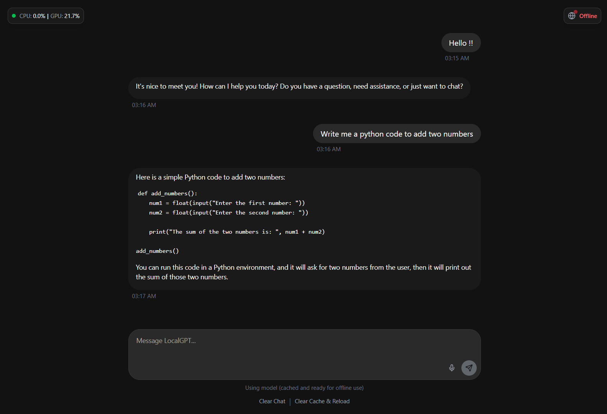

# 🧠 LocalGPT - Truly Offline AI Assistant


**Run powerful AI models directly in your browser - no internet required!**

LocalGPT is a browser-based AI assistant that runs entirely on your device without requiring an internet connection (after initial model download). It's specifically designed for users in rural areas with limited internet access, allowing you to have AI assistance even when completely offline.

> **Note:** You must first use LocalGPT while online to download the model (400MB-900MB). After downloading, you can use it completely offline. See the [Offline Usage Guide](#-offline-usage-guide) for details.


*Screenshot: LocalGPT running in a browser with offline capability*

> Note: Replace the placeholder image with an actual screenshot of your application.

## ✨ Features

- **🔒 100% Local Processing**: All AI processing happens on your device - no data is sent to external servers
- **📵 True Offline Support**: Once the model is downloaded, the app works completely offline
- **💾 Robust Caching**: Models are cached locally for reliable offline use
- **🖥️ Hardware Optimized**: Automatically adapts to your device's capabilities
- **🌐 Network Status Aware**: Shows online/offline status and adapts accordingly
- **📊 Performance Monitoring**: Real-time CPU/GPU usage metrics
- **🎨 Modern UI**: Clean, responsive interface that works on desktop and mobile devices
- **📱 PWA Support**: Install as a standalone app on your device for better offline experience
- **🔄 Production URL Support**: Works on both localhost and production URLs

> **Important:** You must first download the model while online before using offline. See the [Offline Usage Guide](#-offline-usage-guide) for details.

## ⚠️ Response Time Expectations

> **IMPORTANT NOTICE**: LocalGPT runs AI models directly on your device, which means responses are MUCH slower than cloud-based AI services.

- **Initial responses typically take 30 seconds to 5 minutes** depending on your hardware
- Subsequent responses in the same session may be slightly faster
- Smaller models respond faster than larger models
- This is normal and expected for on-device AI processing
- The tradeoff is complete privacy and offline capability

If you need faster responses, consider using a smaller model (see Model Information section below).

## 🚀 Getting Started

1. Clone this repository:

   ```bash
   git clone https://github.com/subhadeeproy3902/localgpt.git
   cd localgpt
   ```

2. Install dependencies:

   ```bash
   npm install
   # or
   yarn install
   # or
   bun install
   ```

3. Run the development server:

   ```bash
   npm run dev
   # or
   yarn dev
   # or
   bun dev
   ```

4. Open [http://localhost:3000](http://localhost:3000) in your browser

## 🧩 How It Works

LocalGPT uses [WebLLM](https://mlc.ai/web-llm/), a technology that allows running AI language models directly in your browser using WebGPU.

### First-Time Use

1. When you first open the app, it will download the AI model (approximately 900MB)
2. This initial download requires an internet connection
3. The download may take several minutes depending on your connection speed
4. A progress bar will show the download status

### Subsequent Use

1. The model is cached in your browser's IndexedDB storage
2. On future visits, the model loads from cache - no download needed
3. You can use the app completely offline once the model is cached

## 🤖 Model Information

LocalGPT currently uses the Llama 3.2 1B model (quantized version), which offers a good balance between performance and resource requirements. The model:

- Requires approximately 900MB of download
- Uses approximately 2GB of memory when running
- Automatically adapts to your device's capabilities
- Will run on most modern computers and high-end mobile devices

### Available Models

You can customize LocalGPT to use different models based on your hardware capabilities. Simply edit the `constant/modelConfig.ts` file and change the `modelId` to one of the following:

#### Small Models (Low Resource Requirements)

- `SmolLM2-135M-Instruct-q0f16-MLC` (~360MB VRAM, very fast)
- `SmolLM2-360M-Instruct-q4f16_1-MLC` (~380MB VRAM, fast)
- `Llama-3.2-1B-Instruct-q4f16_1-MLC` (~880MB VRAM, good balance)
- `gemma-2-2b-it-q4f16_1-MLC-1k` (~1.6GB VRAM, good quality)

#### Medium Models (Moderate Resource Requirements)

- `Phi-3.5-mini-instruct-q4f16_1-MLC-1k` (~2.5GB VRAM, high quality)
- `Llama-3.2-3B-Instruct-q4f16_1-MLC` (~2.3GB VRAM, high quality)
- `gemma-2-2b-it-q4f16_1-MLC` (~1.9GB VRAM, high quality)

#### Large Models (High Resource Requirements)

- `Llama-3.1-8B-Instruct-q4f16_1-MLC-1k` (~4.6GB VRAM, excellent quality)
- `Phi-3.5-mini-instruct-q4f16_1-MLC` (~3.7GB VRAM, excellent quality)
- `Mistral-7B-Instruct-v0.3-q4f16_1-MLC` (~4.6GB VRAM, excellent quality)

### How to Change Models

1. Open the file `constant/modelConfig.ts`
2. Change the `modelId` value to your preferred model from the list above
3. Optionally update the `modelName` for display purposes
4. Save the file and restart the application

Example:

```typescript
// For a smaller, faster model
export const modelId = "SmolLM2-360M-Instruct-q4f16_1-MLC";
export const modelName = "SmolLM 360M";

// For a larger, higher quality model
export const modelId = "Phi-3.5-mini-instruct-q4f16_1-MLC";
export const modelName = "Phi-3.5 Mini";
```

Choose a model that matches your hardware capabilities for the best experience. Smaller models will load faster and respond more quickly, while larger models generally provide higher quality responses.

## 📱 Offline Usage Guide

> **CRITICAL: YOU MUST FIRST USE LOCALGPT ONLINE TO DOWNLOAD THE MODEL BEFORE USING IT OFFLINE!**

The LLM model must be downloaded and cached while you have an internet connection before offline use is possible. This is a mandatory first step.

### Step-by-Step Offline Setup

1. **First Visit (MUST BE ONLINE)**:
   - Open LocalGPT while connected to the internet
   - Wait for the model to fully download (100% on progress bar)
   - This download is approximately 400MB-900MB depending on the model
   - The download may take several minutes on slower connections
   - You'll see "Your LocalGPT has been set" when the model is ready
   - Test the app by sending a few messages to verify it's working

2. **Going Offline**:
   - After the model is fully downloaded and cached, you can disconnect from the internet
   - The app will detect offline status and load the model from cache
   - You'll see "Using model (cached and ready for offline use)" at the bottom
   - All functionality will continue to work without internet

3. **Installing as a PWA (Recommended for Best Offline Experience)**:
   - For the best offline experience, install LocalGPT as a Progressive Web App (PWA)
   - In Chrome/Edge: Click the install icon (➕) in the address bar or use the "Install" button in the app
   - On mobile: Tap "Add to Home Screen" in your browser menu
   - Once installed, LocalGPT will work like a native app, even when offline
   - The PWA version has better storage persistence and offline reliability

4. **Using on Production URLs**:
   - LocalGPT works on both localhost and production URLs (your deployed website)
   - The model cache is specific to each domain, so you'll need to download the model once per domain
   - The PWA can be installed from any URL where LocalGPT is hosted

5. **Troubleshooting Offline Issues**:
   - If you see "Offline mode - model not available", it means you didn't complete the online download
   - You MUST connect to the internet and let the model fully download first
   - If the model doesn't load offline after downloading, try clearing your browser cache and redownloading
   - Some browsers limit offline storage - Chrome works best for offline use
   - The app includes diagnostic information at the bottom to help identify issues
   - For persistent storage issues, install as a PWA for better reliability

## 🔧 Performance Tips

To get the best experience with LocalGPT:

1. **Choose the Right Model**: Select a model that matches your hardware capabilities:
   - For slower devices: Use `SmolLM2-135M-Instruct-q0f16-MLC` or `SmolLM2-360M-Instruct-q4f16_1-MLC`
   - For average devices: Use `Llama-3.2-1B-Instruct-q4f16_1-MLC` (default)
   - For powerful devices: Try `Phi-3.5-mini-instruct-q4f16_1-MLC` or larger models

2. **Use a Modern Browser**: Chrome or Edge with WebGPU support works best

3. **Hardware Acceleration**: Ensure your browser has hardware acceleration enabled:
   - Chrome: Settings → System → Use hardware acceleration when available
   - Edge: Settings → System and performance → Use hardware acceleration when available

4. **Patience**: The first response after loading may be slower as the model warms up

5. **Keep Questions Concise**: Shorter questions generally receive faster responses

6. **Close Other Tabs**: Reducing browser load can improve performance

7. **Restart Occasionally**: If performance degrades over time, refresh the page

## 🏗️ Building for Production

To create an optimized production build:

```bash
npm run build
npm run start
# or
yarn build
yarn start
# or
bun build
bun start
```

### Deploying to a Production URL

When deploying to a production URL, the PWA and offline functionality will work automatically. The service worker will be registered and the app will be installable as a PWA.

1. **Build the project** using the commands above
2. **Deploy the build** to your hosting provider (Vercel, Netlify, etc.)
3. **Visit your production URL** and verify that the app works
4. **Download the model** while online to enable offline functionality
5. **Install as a PWA** for the best offline experience

Note that the model cache is domain-specific, so users will need to download the model once for each domain where LocalGPT is hosted.

## 📋 System Requirements

- **Browser**: Chrome 113+ or Edge 113+ with WebGPU support
- **OS**: Windows 10/11, macOS, Linux, or Android
- **RAM**: 4GB minimum, 8GB+ recommended
- **GPU**: Integrated graphics minimum, dedicated GPU recommended
- **Storage**: 1GB free space for model caching

## 📄 License

This project is licensed under the MIT License - see the LICENSE file for details.

## 🙏 Acknowledgements

- [MLC-AI](https://mlc.ai/) for WebLLM technology
- [Next.js](https://nextjs.org/) for the web framework
- [shadcn/ui](https://ui.shadcn.com/) for UI components

## 🤝 Contributing

Contributions are welcome! Please feel free to submit a Pull Request.

## 📬 Contact

For questions or feedback, please open an issue on GitHub or reach out to the maintainer:

- GitHub: [@subhadeeproy3902](https://github.com/subhadeeproy3902)
